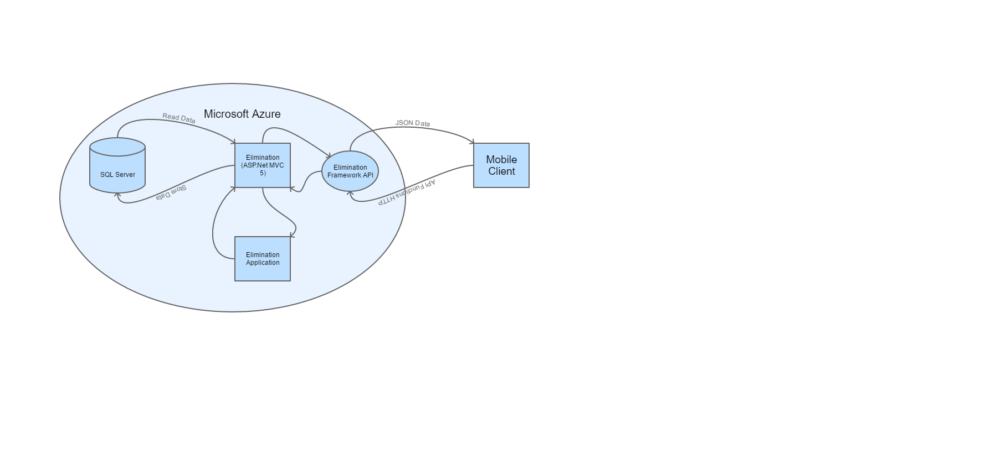
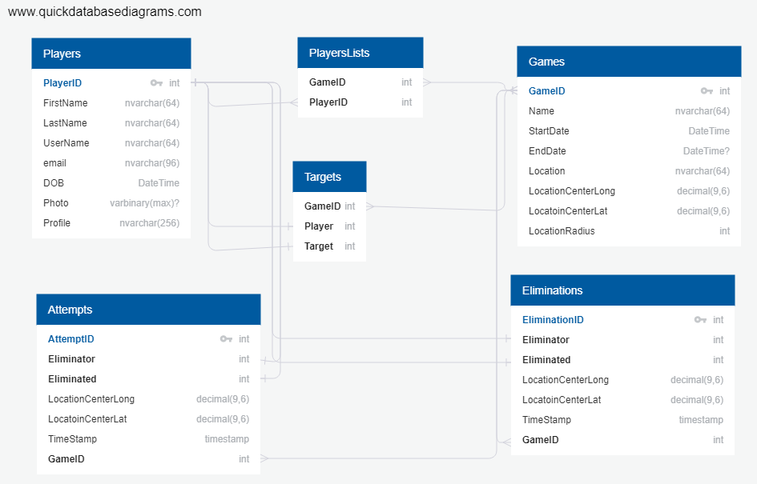

# [Portfolio Home](https://mgeorgebrown89.github.io/CS-Portfolio) - [CS 461](https://mgeorgebrown89.github.io/CS-Portfolio/CS-461) - Milestone 5
## Class Project Retrospective | Team Project Inception Conclusion | Team Project Construction
### [Requirements](http://www.wou.edu/~morses/classes/cs46x/assignments/t2/M5.html)

For Milestone 5, we finished the class project with a retrospective meeting. We then went over our inception documents and made any changes after having a review meeting with our professor. The third task was to make our project welcome page on bitbucket. And finally, we went through a round of backlog refinement and planned for Sprint 1. 

### Task 1: Class Project Retrospective

1. Safety Check
    * We determined that based on the candor with which we discussed safety checks, that it was unnecessary for us to perform a safety check.
2. What did you learn?
    * "Pay closer attention to merge conflicts and how to solve them."
    * "Front-end skills suck."
    * "MVVM!"
    * "Triple-composite keys are annoying."
3. What still puzzles you?
    * "Why did we have a triple-composite key in the first place?"
4. What can the team do better during the next Sprint? 
    * Action Plan:
        * Make an itinerary for our planning meetings
        * Working on one thing at a time as a group
        * Making a development database on Azure 
        * if you delete files out of VS, do it in VS, not from the file viewer
        * third-party libraries, check with everyone
5. Are there any items that need to be brought up with someone outside the team? (i.e. in this case the instructor)
    * Survey says "no!"

### Task 2: Team Project Inception (III)

We had to update our architecture diagram to include the actual web service and specify the mobile clients. Here is the updated diagram:

We needed to update our needs and requirements to include our Rest API. You can see that on the official project page.

We also needed to update our ER diagram. Here is the updated diagram:

### Task 3: Team Project Inception (III)

For task 3, we had to make a welcome page on our repository for the project. You can see that here. 

### Task 4: Team Project Construction

For this final task, we held a backlog refinement meeting and updated some of our Product Backlog Items, broke them down into tasks, assigned them to individuals and committed them to Sprint 1. 

